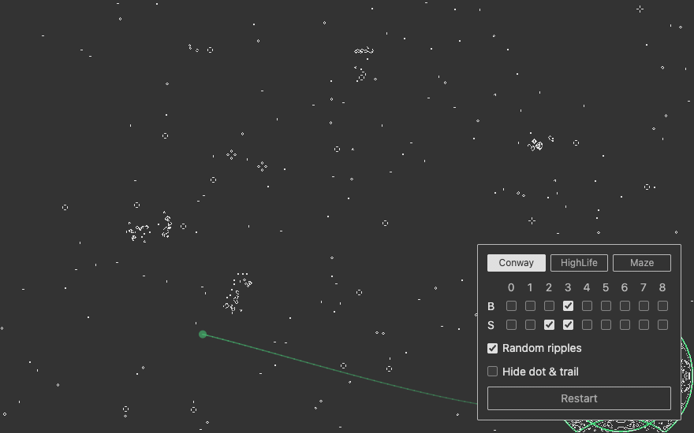

# life-game

Conway's Game of Life as a full-page interactive canvas. Originally a 2012
Delphi (VCL) toy, ported to TypeScript + Vite and grown into a small
water-garden: click the field and waves ripple out, bounce off the edges, and
feed the simulation.



## Features

- Full-viewport field, 1 cell per CSS pixel; starts automatically on load
- Click: three expanding wavefronts of live cells ripple from the cursor,
  reflect off the field edges (image-source method), and leave a churning
  wake; the moving front is highlighted in green
- "God's touch": an invisible point wanders along a smooth random spline
  (Catmull-Rom), dropping ripples at random intervals and on sharp bends;
  its trail renders at 50% opacity and fades with age
- Control panel (bottom-right; full-width on narrow screens):
  - One-click rule presets: Conway (B3/S23), HighLife (B36/S23), Maze (B3/S12345)
  - Born/Survive rule checkboxes for 0–8 neighbours, for anything beyond the
    presets; the matching preset highlights automatically
  - Random ripples on/off, trail visibility, restart with a fresh soup
- Window resize preserves the existing pattern; newly exposed areas arrive
  pre-settled (the dense random soup is evolved invisibly for a few
  generations before it is ever rendered)
- Light/dark theme follows the system (`prefers-color-scheme`), including
  the canvas colors

## Engine

The simulation is a change-list cellular automaton over flat `Uint8Array`s:
each generation only cells adjacent to last generation's changes are
re-evaluated (with an automatic full-sweep fallback when most of the field
is active, e.g. under explosive rules). Rendering is equally sparse — only
changed pixels are rewritten in a persistent `ImageData` viewed through a
`Uint32Array`. At full-HD field sizes the steady-state step measures ~20×
faster than a brute-force scan while producing bit-identical generations.
Border cells always die (a quirk inherited from the 2012 original and kept
deliberately).

## Development

```bash
npm install
npm run dev        # http://localhost:5173
npm run typecheck
npm run build      # production bundle in dist/
```

## Structure

- `ts/LifeGame.ts` — the engine: rules, change list, ripple stamping, sparse renderer
- `ts/main.ts` — canvas wiring, animation loop, ripples, god's touch, control panel
- `index.html` — page, panel styles, theme palette

## License

[MIT](LICENSE)
